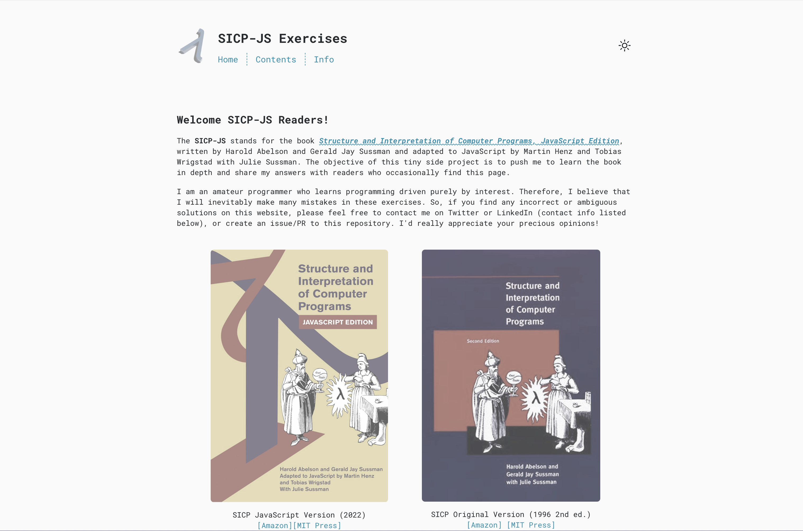

# SICP Exercise Solutions

Website: https://terrence-ou.github.io/SICP-Website/

The SICP-JS stands for the book **Structure and Interpretation of Computer Programs, JavaScript Edition**, written by Harold Abelson and Gerald Jay Sussman and adapted to JavaScript by Martin Henz and Tobias Wrigstad with Julie Sussman. The objective of this tiny side project is to push me to learn the book in depth and share my answers to the exercises in the book with readers who occasionally find this repository.

Website screenshot:
 

# License
Distributed under the MIT License. See LICENSE for more information.