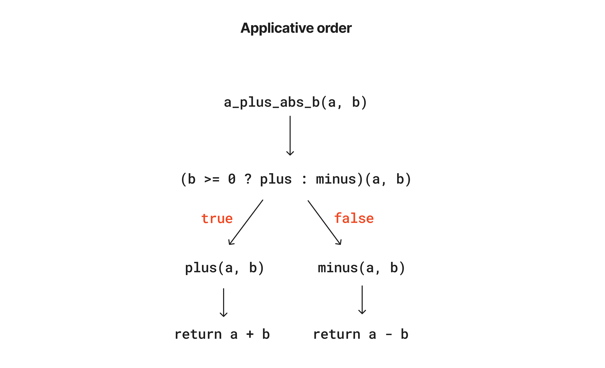
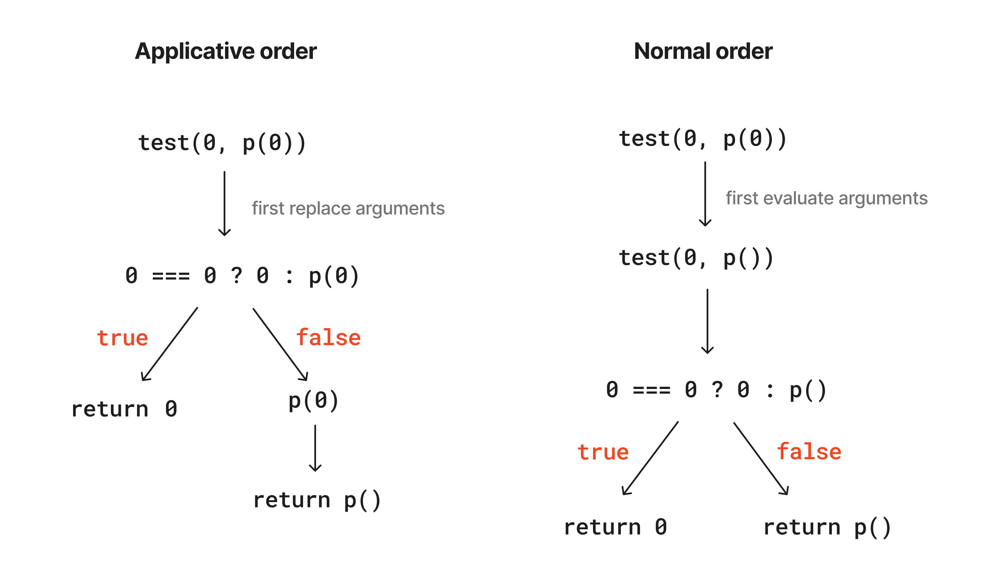

## Exercise 1.1

Print out the given sequence of statements:

```js title="exercise_1_1.js"
console.log("\n==========Exercise 1.1==========");
console.log("10: ", 10);
console.log("5 + 3 + 4: ", 5 + 3 + 4);
console.log("9 - 1: ", 9 - 1);
console.log("6 / 2: ", 6 / 2);
console.log("2 * 4 + (4 - 6): ", 2 * 4 + (4 - 6));

const a = 3;
const b = a + 1;
console.log("const a = 3");
console.log("const b = a + 1: ", b);
console.log("a + b + a * b: ", a + b + a * b);
console.log("a === b: ", a === b);
console.log("b > a && b < a * b ? b : a ", b > a && b < a * b ? b : a);
console.log(
  "a === 4 ? 6 : b === 4 ? 6 + 7 + a : 25",
  a === 4 ? 6 : b === 4 ? 6 + 7 + a : 25
);
console.log("2 + (b > a ? b : a) ", 2 + (b > a ? b : a));
console.log(
  "(a > b ? a : a < b ? b : -1) * (a + 1) ",
  (a > b ? a : a < b ? b : -1) * (a + 1)
);
```
output:
```
==========Exercise 1.1==========
10:  10
5 + 3 + 4:  12
9 - 1:  8
6 / 2:  3
2 * 4 + (4 - 6):  6
const a = 3
const b = a + 1:  4
a + b + a * b:  19
a === b:  false
b > a && b < a * b ? b : a  4
a === 4 ? 6 : b === 4 ? 6 + 7 + a : 25 16
2 + (b > a ? b : a)  6
(a > b ? a : a < b ? b : -1) * (a + 1)  16
```

---

## Exercise 1.2

Translate the following expression into JavaScript:

$$
\frac{5 + 4 + (2 - (3 -(6 + \frac{4}{5})))}{3(6-2)(2-7)}
$$

```js title="exercise_1_2.js"
console.log("\n==========Exercise 1.2==========");
function eval() {
  return (5 + 4 + (2 - (3 - (6 + 4 / 5)))) / (3 * (6 - 2) * (2 - 7));
}
console.log("Evaluation result: ", eval().toFixed(4));
```
output:
```
==========Exercise 1.2==========
Evaluation result:  -0.2467
```

---

## Exercise 1.3

Declare a function that takes three numbers as arguments and returns the sum of the squares of the two larger number:

```js title="exercise_1_3.js"
console.log("\n==========Exercise 1.3==========");
function squareSumLargerTwo(num1, num2, num3) {
  if (num2 > num1) [num1, num2] = [num2, num1];
  if (num3 >= num1) [num1, num2] = [num3, num1];
  else if (num3 >= num2) num2 = num3;
  return num1 ** 2 + num2 ** 2;
}

console.log(
  "The sum of the square of two larger numbers in [10, 2, 3]: ",
  squareSumLargerTwo(10, 2, 3)
);
```
output:
```
==========Exercise 1.3==========
The sum of the square of two larger numbers in [10, 2, 3]:  109
```
---

## Exercise 1.4

Describe the behavior of `a_plus_abs_b` provided in the book:



---

## Exercise 1.5

Evaluate Ben Bitdiddle's function in both applicative-order and normal-order.



---

## Exercise 1.6

Alyssa P. Hacker proposed an "optimized" function of the square root iteration function provided in the book:

```js title="AlyssaConditionalSqrt.js"
function conditional(predicate, then_clause, else_clause) {
  return predicate ? then_clause : else_clause;
}

function alyssaSqrtIter(guess, x) {
  return conditional(
    isGoodEnough(guess, x),
    guess,
    sqrtIter(improve(guess, x), x)
  );
}
```

However, This function won't work because when the `conditional(a, b, c)` function been called, all three arguments will be evaluated immediately thus make the program stuck in a infinite loop.

---

## Exercise 1.7

Optimizing square root function by comparing the current guess with the previous guess:

```js title="sqrtHelper.js"
function sqrtIter(guess, x) {
  return isGoodEnough(guess, x) ? guess : sqrtIter(improve(guess, x), x);
}

function isGoodEnough(guess, x) {
  return Math.abs(guess ** 2 - x) < 1e-3;
}

function improve(guess, x) {
  return average(guess, x / guess);
}

function average(x, y) {
  return (x + y) / 2;
}

function sqrt(x) {
  return sqrtIter(1, x);
}
```

Improved iteration function:

```js title="exercise_1_7.js"
function improvedSqrtIter(guess, x, prevGuess) {
  return improvedIsGoodEnough(guess, prevGuess)
    ? guess
    : improvedSqrtIter(improve(guess, x), x, guess);
}

function improvedIsGoodEnough(guess, prevGuess) {
  return Math.abs(guess - prevGuess) < 1e-3;
}

function improvedSqrt(x) {
  return improvedSqrtIter(1, x, 0);
}

console.log("\n==========Exercise 1.7==========");
console.log("Calculate the square root of 0.0001");
console.log("old method result", sqrt(0.0001));
console.log("improved method result", improvedSqrt(0.0001));
```

output:

```
Calculate the square root of 0.0001
old method result 0.03230844833048122
improved method result 0.010000714038711746
```

---

## Exercise 1.8

Implement cubic-root function with the formular:
$$
\frac{x / y^2 + 2y}{3}
$$

```js title="exercise_1_8.js"
function cubicRootIter(guess, x, prevGuess) {
  return isCubicGoodEnough(guess, prevGuess)
    ? guess
    : cubicRootIter(improveCubicRoot(guess, x), x, guess);
}

function improveCubicRoot(guess, x) {
  return (x / guess ** 2 + 2 * guess) / 3;
}

function isCubicGoodEnough(guess, prevGuess) {
  return Math.abs(guess - prevGuess) < 1e-3;
}

function cubicRoot(x) {
  return cubicRootIter(1, x, 0);
}

console.log("\n==========Exercise 1.8==========");
console.log("The approx. cubic root of 8: ", cubicRoot(8));
console.log("The approx. cubic root of 27: ", cubicRoot(27));
```

output:

```
==========Exercise 1.8==========
The approx. cubic root of 8:  2.000000000012062
The approx. cubic root of 27:  3.0000000000000977
```