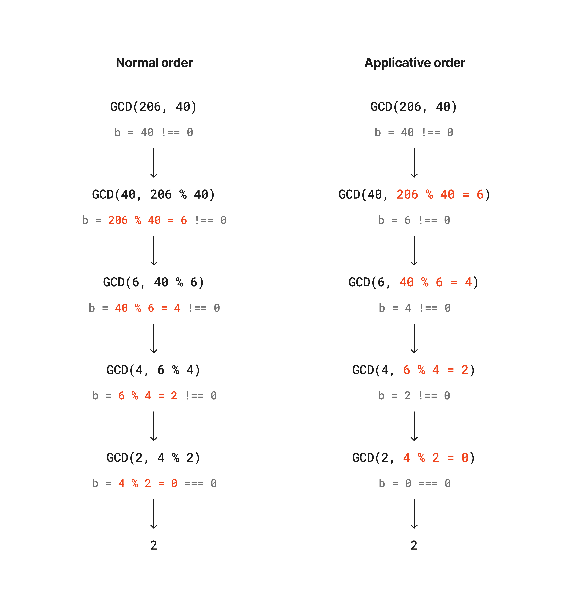

## Exercise 1.20

The following diagrams show the difference of the process in evaluating the `remainder` operation between normal order and applicative order substitution methods; the red part is where the `remainder` operation actually happend. The `remainder` operation actually performed 4 times in both methods.



---

# Exercise 1.21

The helper functions for computing a smallest divisor of a given number `n`:

```js title="smallestDivisor.js"
function smallestDivisor(n) {
  return findDivisor(n, 2);
}

function findDivisor(n, testDivisor) {
  return testDivisor ** 2 > n
    ? n
    : divides(testDivisor, n)
      ? testDivisor
      : findDivisor(n, testDivisor + 1);
}

function divides(a, b) {
  return b % a === 0;
}

function isPrime(n) {
  return n === smallestDivisor(n);
}
```
Get the smallest divisor of each of the given numbers:

```js title="exercise_01_21.js"
console.log("\n==========Exercise 1.21==========");
console.log("The smallest divisor of 199:", smallestDivisor(199));
console.log("The smallest divisor of 1999:", smallestDivisor(1999));
console.log("The smallest divisor of 19999:", smallestDivisor(19999));
```

outputs:

```
==========Exercise 1.21==========
The smallest divisor of 199: 199
The smallest divisor of 1999: 1999
The smallest divisor of 19999: 7
```

---

## Exercise 1.22

The helper functions for timing the prime number evaluation:

```js title="timedPrimeTest.js"
function timedPrimeTest(n, timeIt = false) {
  return startPrimeTest(n, timeIt);
}

function startPrimeTest(n, timeIt) {
  if (timeIt) console.time(`test prime ${n}`);
  return isPrime(n) ? reportPrime(n, timeIt) : false;
}

function reportPrime(n, timeIt) {
  console.log(" *** ");
  console.log("find prime number:", n);
  if (timeIt) console.timeEnd(`test prime ${n}`);
  return true;
}
```

Search the three smallest prime numbers larger then the `startNumber`.

```js title="exercise_1_22.js"
function searchForPrimes(startNumber, k = 3, timeIt = false) {
  console.log(`\nGet first ${k} prime number(s) larger than ${startNumber}`);
  startNumber += startNumber % 2 === 0 ? 1 : 0;
  while (k > 0) {
    if (timedPrimeTest(startNumber, timeIt)) k -= 1;
    startNumber += 2; // plus 2 because we want to skip even numbers
  }
}

console.log("\n==========Exercise 1.22==========");
searchForPrimes(1000);
searchForPrimes(10000);
searchForPrimes(100000);
searchForPrimes(1000000);

console.log("\n--Timed test--");
searchForPrimes(100000, 1, true);
searchForPrimes(1000000, 1, true);
```

outputs:

```
==========Exercise 1.22==========

Get first 3 prime number(s) larger than 1000
 ***
find prime number: 1009
 ***
find prime number: 1013
 ***
find prime number: 1019

Get first 3 prime number(s) larger than 10000
 ***
find prime number: 10007
 ***
find prime number: 10009
 ***
find prime number: 10037

Get first 3 prime number(s) larger than 100000
 ***
find prime number: 100003
 ***
find prime number: 100019
 ***
find prime number: 100043

Get first 3 prime number(s) larger than 1000000
 ***
find prime number: 1000003
 ***
find prime number: 1000033
 ***
find prime number: 1000037

--Timed test--

Get first 1 prime number(s) larger than 100000
 ***
find prime number: 100003
test prime 100003: 0.038ms

Get first 1 prime number(s) larger than 1000000
 ***
find prime number: 1000003
test prime 1000003: 0.052ms
```

The order of growth of the find prime algorithm is $\Theta(\sqrt{n})$; therefore, by consumption, the time needed to evaluate the primality of 1000003 possibly be $\sqrt{n}$ times of the time required to evaluate 100003. By running the timed test for 10 times, I found the average ratio of evaluation time of 1000003 and 100003 is around 1.5, slightly less than the half of $\sqrt{10}$. This discrepancy could be due to many reasons, but at least it does unveil that a larger number requires more time to evaluate.

---

## Exercise 1.23

A way of optimizing the `isPrime(n)` algorithm is to skip the even numbers except 2, because every even number's smallest divider is 2; taking those numbers into consideration definetly a waist of computing resources. The optimized function is as follows:

```js title="exercise_1_23.js"
const foundPrimes = [
  1009, 1013, 1019, 10007, 10009, 
  10037, 100003, 100019, 100043, 
  1000003, 1000033, 1000037,
];

function modifiedSmallestDivisor(n) {
  return modifiedFindDivisor(n, 2);
}

function next(testDivisor) {
  if (testDivisor === 2) return 3;
  else return testDivisor + 2;
}

function modifiedFindDivisor(n, testDivisor) {
  return testDivisor ** 2 > n
    ? n
    : divides(testDivisor, n)
      ? testDivisor
      : findDivisor(n, next(testDivisor));
}

function modifiedIsPrime(n) {
  return n === modifiedSmallestDivisor(n);
}

function timePrimes(callbackFn, primeNumbers) {
  console.time(`Total time for ${callbackFn.name}`);
  primeNumbers.forEach((num) => callbackFn(num));
  console.timeEnd(`Total time for ${callbackFn.name}`);
}

console.log("\n==========Exercise 1.23==========");
timePrimes(isPrime, foundPrimes);
timePrimes(modifiedIsPrime, foundPrimes);
```
outputs:

```
==========Exercise 1.23==========
Total time for isPrime: 0.141ms
Total time for modifiedIsPrime: 0.077ms
```

I ran both algorithms 10 times and found that in most of the cases, the optimized function runs approximately twice as faster as the original one. As we halved the test cases in the optimized one, the result quite reflects our optimization.

---

## Exercise 1.24

Fermat's Little Theorem - a probabilistic method

```js title="fermatTest.js"
function expmod(base, exp, m) {
  return exp === 0
    ? 1
    : exp % 2 === 0
      ? expmod(base, exp / 2, m) ** 2 % m
      : (base * expmod(base, exp - 1, m)) % m;
}

function fermatTest(n) {
  function tryIt(a) {
    return expmod(a, n, n) === a;
  }
  return tryIt(1 + Math.floor(Math.random() * (n - 1)));
}

function fastIsPrime(n, times = 1) {
  return times === 0 
    ? true 
    : fermatTest(n) 
      ? fastIsPrime(n, times - 1) 
      : false;
}
```

In this test, I chose three numbers near 1,000 and 1,000,000 respectively, and test each prime number for 100 times, to figure out how the number affects the evaluation time:

```js title="exercise_1_24.js"
console.log("\n==========Exercise 1.24==========");
console.time("Evaluating prime numbers near 1000");
fastIsPrime(1009, 100);
fastIsPrime(1013, 100);
fastIsPrime(1019, 100);
console.timeEnd("Evaluating prime numbers near 1000");

console.time("Evaluating prime numbers near 1000000");
fastIsPrime(1000003, 100);
fastIsPrime(1000033, 100);
fastIsPrime(1000037, 100);
console.timeEnd("Evaluating prime numbers near 1000000");
```

output:

```
==========Exercise 1.24==========
Evaluating prime numbers near 1000: 0.442ms
Evaluating prime numbers near 1000000: 0.811ms
```

Theoretically, the order of growth of the numbers above is around $\Theta(\log{1000})$ and $\Theta(\log{1000000})$, therefore the evaluation time of the prime numbers near 1,000,000 is supposed to be $\log{1000} \approx 6.9$ time of the time needed evaluating prime numbers near 1,000. However, the output shows that evaluating larger numbers takes around twice the time of the small numbers. I cannot really figure out what causes such discrepancy so far.

---

## Exercise 1.25

Alyssa P. Hacker proposed a "consice" way of implementing the `expmod` function:

```js title="alyssaExpmod.js"
function expmod(base, exp, m){
  return fastExpt(base, exp) % m;
}
```

This implementation is a bit problematic. Let's first take a look at the original implementation:

```js title="fermatExpmod.js"
function expmod(base, exp, m){
  return exp === 0:
    ? 1
    : isEven(exp)
      ? square(expmod(base, exp / 2, m) % m)
      : (base * expmod(base, exp - 1, m)) % m
}
```

The difference between the two implementations is that Alyssa's method returns $base^{exp} \% m$, while the original method returns $(base^{(exp/2)} \% m )^2 \% m$ or $((base^{(exp - 1)} \% m )\times base) \% m$; the two methods return different results.

---

## Exercise 1.26

Louis Reasoner implemented the `expmod` function in the following way:

```js showLineNumbers=true title="louisExpmod.js"
function expmod(base, exp, m){
  return exp === 0
    ? 1
    : isEven(exp)
      ? (expmod(base, exp / 2, m) * expmod(base, exp / 2)) % m
      : (base * expmod(base, exp - 1, m)) % m
}
```

The growth of this function is actually $\Theta(n)$ rather than $\Theta(\log n)$. The problem actually happens in line 5, where the multiplication of two `expmod` functions makes the growth become $\Theta(\log n) \times \Theta(\log n) = \Theta(n)$.

---

## Exercise 1.27