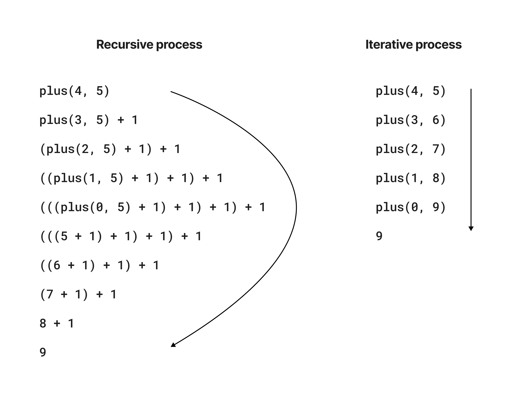
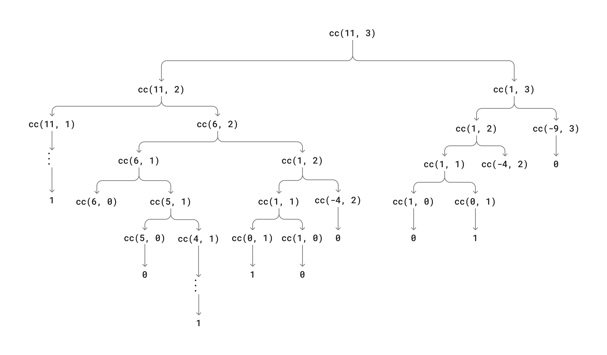

## Exercise 1.9

- **functions**:

  ```js
  // Recursive
  function plus(a, b){
    return a === 0 ? b : inc(plus(dec(a), b));
  }

  // Iterative
  function plus(a, b){
    return a === 0 ? b : plus(dec(a), inc(b));
  }
  ```

The evaluation process of the iterative/recursive version of `plus(a, b)`:



---

## Exercise 1.10

The evaluation of the Ackermann's function:

``` js title="Ackermann.js"
function A(x, y) {
  return y === 0 ? 0 : x === 0 ? 2 * y : y === 1 ? 2 : A(x - 1, A(x, y - 1));
}

console.log("\n==========Exercise 1.10==========");
console.log("The result of A(1, 10): ", A(1, 10));
console.log("The result of A(2, 4): ", A(2, 4));
console.log("The result of A(3, 3): ", A(3, 3));
```
output:
```
==========Exercise 1.10==========
The result of A(1, 10):  1024
The result of A(2, 4):  65536
The result of A(3, 3):  65536
```

Mathematical definitions for the provided functions:

- **function 1**:

  ```js
  function f(n) { return A(0, n); }
  ```
  The math expression of `f(n)` is: $2n$

- **function 2**:

  ```js
  function g(n) { return A(1, n); }
  ```
  *Function expansion*:
  ```
  A(1, n)
  A(0, A(1, n - 1)) = 2 * A(1, n - 1)
  2 * A(0, A(1, n - 2)) = 2 * 2 * A(1, n - 2)
  ...
  2 * 2 * 2 * 2 * ... * A(1, 0) = 2 * 2 * 2 * 2 * ... * 2

  ```

  Therefore, the math expression of `g(n)` is: $2^n$

- **function 3**:

  ```js
  function h(n) { return A(2, n); }
  ```
  *Function expansion*:
  ```
  A(2, n)
  A(1, A(2, n - 1)) = 2 ** (A(2, n - 1))
  2 ** 2 * (A(1, n - 2)) = 2 ** (2 ** A(2, n - 2))
  ...
  2 ** (2 ** (2 ** (2 ** (...** (2 * 0)...)))) 
  ```
  Therefore, the math expression of `h(n)` is: $^{(n-1)}2 = 2 ^{2^{2^{\cdot ^{\cdot ^{2}}}}}$

- **function 4**:

  ```js
  function k(n) { return 5 * n * n; }
  ```
  The math expression of `k(n)` is: $5n^2$

---

## Exercise 1.11

The JavaScript version of the math function $f$ in both recursive and iterative methods

``` js title="exercise_1_11.js"
//recursive method
function fr(n) {
  return n < 3 ? n : fr(n - 1) + 2 * fr(n - 2) + 3 * fr(n - 3);
}

//iterative method
function fi(n) {
  return fi_iter(2, 1, 0, n);
}
function fi_iter(a, b, c, n) {
  return n === 0 ? c : n === 1 ? b : fi_iter(a + 2 * b + 3 * c, a, b, n - 1);
}

console.log("\n==========Exercise 1.11==========");
console.time("f(n) recursive method total time: ");
console.log("result of f(20) recursive method: ", fr(20));
console.timeEnd("f(n) recursive method total time: ");
console.time("f(n) iterative method total time: ");
console.log("result of f(20) iterative method: ", fr(20));
console.timeEnd("f(n) iterative method total time: ");
```

output:

```
==========Exercise 1.11==========
result of f(20) recursive method:  10771211
f(n) recursive method total time: : 1.574ms
result of f(20) iterative method:  10771211
f(n) iterative method total time: : 0.529ms
```

---

## Exercise 1.12

Pascal's triangle:

``` js title="exercise_1_12.js"
function pascalTriangle(row, col) {
  return col === 0 || col === row
    ? 1
    : pascalTriangle(row - 1, col - 1) + pascalTriangle(row - 1, col);
}

// Helper function to print out the pascal triagnle with given number of rows
function printPascalTriangle(n) {
  const totalPad = n - 1;
  for (let row = 0; row < n; row++) {
    let str = "".padStart(totalPad - row, " ");
    for (let col = 0; col < row + 1; col++) {
      str += pascalTriangle(row, col);
      str += " ";
    }
    console.log(str);
  }
}

console.log("\n==========Exercise 1.12==========");
console.log("A pasccal triangle with 5 rows:");
printPascalTriangle(5);
```

output:

```
==========Exercise 1.12==========
A pasccal triangle with 5 rows:
    1
   1 1
  1 2 1
 1 3 3 1
1 4 6 4 1

```

---

## Exercise 1.13

#### Step 1
We assume that $$Fib(n) = r^n$$, and the recursive format of $Fib(n)$ can be expressed as:\
$$r^n = r^{n - 1} + r ^ {n - 2}$$
Assuming that $r \neq 0$, we divide both sides by $r^{n - 2}$, and get:
$$r^2 = r + 1$$
Given that in the quadratic formula $ax^2 + bx + c = 0$:

$$
x = \frac{-b \pm \sqrt{b^2 - 4ac}}{2a}
$$

We can solving the equation:

$$
r = \frac{1 \pm \sqrt{5}}{2}
$$

Then we can denote each solution as:


$$
\phi = \frac{1 + \sqrt{5}}{2}, \quad
\psi = \frac{1 - \sqrt{5}}{2}
$$

#### Step 2
The Fibonacci sequence if a linear homogeneous recurrence relation of the second degree, its general solution is a linear combination of the solutions found:

$$
Fib(n) = A(\phi^n) + B(\psi^n)
$$

For $n = 0, Fib(0) = 0$ and $n = 1, Fib(1) = 1$, we can find the values of $A$ and $B$:

$$
A + B = 0 \\
A\phi + B\psi = 1 \\
A = \frac{1}{\sqrt{5}}, \quad B = -\frac{1}{\sqrt{5}} \\
$$

#### Step 3
Now we subsitute $A$ and $B$ back into the general solution:

$$
Fib(n) = \frac{1}{\sqrt{5}}\phi^n - \frac{1}{\sqrt{5}}\psi^n = \frac{\phi^n - \psi^n}{\sqrt{5}} 
$$

With n increasing, $\psi^n$ will gradually approaching 0, therefore $Fib(n)$ is the closest integer to $\phi^n / \sqrt{5}$

---

## Exercise 1.14

The tree-recursive process generated in computing `count_change(11)` function:



The step has $\Theta(2^N)$ order of growth, where $N$ is the target amount;
The order of growth of the space is $\Theta(N \cdot m)$, where $N$ is the target amount and $m$ is the number of coin dominations, because each combination of amount and coin denomication is calculated only once.

---

## Exercise 1.15

Compute the sine value of an angle:

``` js title="exercise_1_15.js"

let runCounts = 0;

function cube(x) {
  return x * x * x;
}

function p(x) {
  runCounts += 1;
  return 3 * x - 4 * cube(x);
}

function sine(angle) {
  return !(Math.abs(angle) > 0.1) ? angle : p(sine(angle / 3));
}

console.log("\n==========Exercise 1.15==========");
console.log(sine(3.14));
console.log(
  "The total time of the function p runs when evaluation sine(3.14) is: ",
  runCounts
);
```
output:

```
==========Exercise 1.15==========
0.0008056774674223277
The total time of the function p runs when evaluation sine(3.14) is:  4
```

The number of steps of `sine(angle)` is $\Theta(\log_3\frac{N}{m})$, where $N$ is the angle, and $m$ is the precision; \
The space complexity is also $\Theta(\log_3\frac{N}{m})$, reflecting the depth of the recursive calls. 